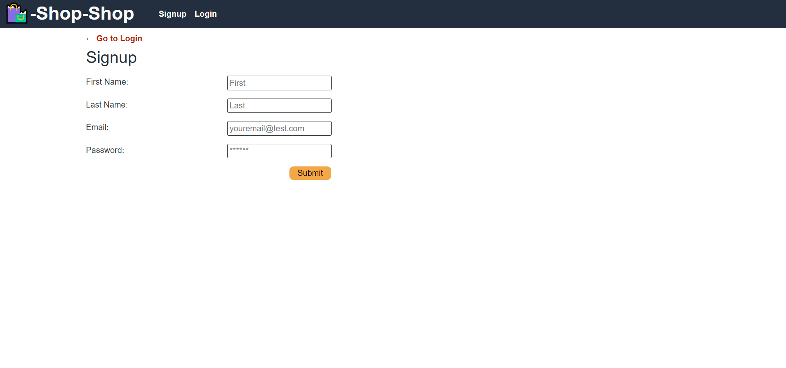
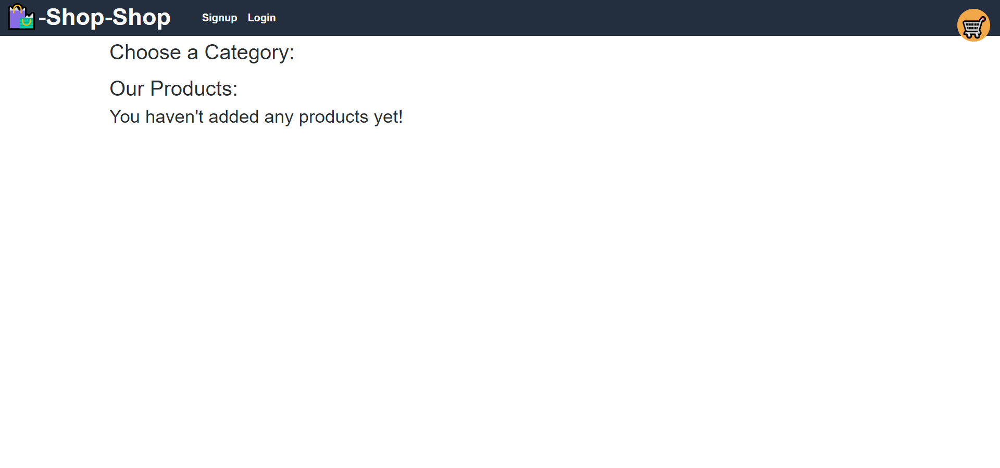
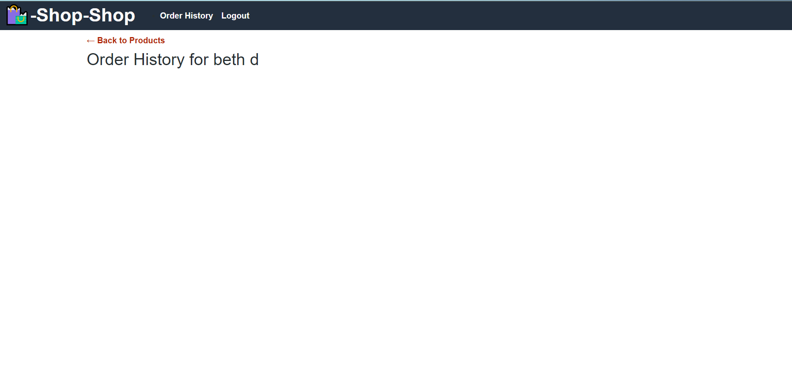

# Redux Assignment

## Table of Contents
- [About](#about) 
- [Contributors](#contributors)
- [Installation](#installation)
- [Screenshots](#screenshots)

## About
Homework to change the code from a classwork assignment into a redux.

[View the live application](https://young-harbor-65403.herokuapp.com/) in Heroku.

### Languages Used
- JavaScript (React)
- MongoDB
- HTML
- CSS

### Node Libraries Used
- [Apollo Server](https://www.npmjs.com/package/apollo-server-express)
- [Express](https://www.npmjs.com/package/express)
- [JSON Web Token](https://www.npmjs.com/package/jsonwebtoken)
- [GraphQL](https://www.npmjs.com/package/graphql)
- [React](https://www.npmjs.com/package/react)
- [Redux](https://www.npmjs.com/package/redux)

See [server package.json](./server/package.json) and [client package.json](./client/package.json) for full list of dependencies.


## Contributors
None

## Live Application
[View application deployment](https://young-harbor-65403.herokuapp.com/) in Heroku.

## Installation
To run this application on your local machine, Node.js is _required_. Once cloned/downloaded from GitHub, enter ```npm i``` in command line to install the packages referenced under Libraries Used automatically. 
You are now be ready to launch the application by entering ```npm run dev```.


## Screenshots

 

The following animation shows how the user can select a category, choose a product, view details about it on the product page, and add and remove it from their shopping cart:




